# DevMLOps Architecture - Sistem End-to-End Machine Learning Operations

[](https://mage.ai)
[](https://mlflow.org)
[](https://fastapi.tiangolo.com)
[](https://streamlit.io)
[](https://dvc.org)
[](https://docker.com)

Implementasi lengkap **End-to-End Machine Learning Operations (MLOps)** yang digabungkan dengan prinsip **DevOps**. Sistem ini melatih model K-Means untuk pengelompokan provinsi berdasarkan data pendidikan, sambil menjamin reproduktifitas data, otomatisasi deployment, dan pemantauan kinerja model secara real-time.

## 📋 Daftar Isi

1. [Latar Belakang & Ruang Lingkup](#latar-belakang--ruang-lingkup)
2. [Arsitektur Sistem Global](#arsitektur-sistem-global)
3. [Tech Stack & Library](#tech-stack--library)
4. [Spesifikasi Implementasi Detail](#spesifikasi-implementasi-detail)
5. [Pipeline Otomatisasi (CI/CD/CT)](#pipeline-otomatisasi-ccdct)
6. [Skenario Studi Kasus](#skenario-studi-kasus)
7. [Panduan Instalasi](#panduan-instalasi)
8. [Berkontribusi](#berkontribusi)

---

## 🎯 Latar Belakang & Ruang Lingkup

### Tujuan Bisnis
Memberikan wawasan berbasis data kepada pemangku kepentingan (pemerintah/dinas) mengenai klaster pendidikan provinsi.

### Tujuan Teknis
Membangun pipeline otomatis (CI/CD/CT) yang meminimalisir intervensi manual dan kesalahan manusia.

### Karakteristik Data
Data tabular dinamis (PostgreSQL) yang memerlukan pelacakan versi (Versioning).

---

## 🏗️ Arsitektur Sistem Global

Sistem dibangun di atas **4 Pilar Arsitektur** yang saling menopang:

```mermaid
graph TB
    subgraph Data["🗄️ DATA & ORCHESTRATION"]
        PostgreSQL[("PostgreSQL 15")]
        Mage["🔄 Mage.ai<br/>ETL Pipeline"]
    end

    subgraph Experiment["📝 EXPERIMENTATION & VERSIONING"]
        DVC["📦 DVC<br/>Data Version Control"]
        MLflow["📊 MLflow<br/>Experiment Tracking"]
        RemoteStorage[("☁️ Remote Storage<br/>AWS S3")]
    end

    subgraph Training["🧠 MACHINE LEARNING"]
        ScikitLearn["🔬 Scikit-Learn<br/>K-Means"]
        Pipeline["⚙️ Training Pipeline<br/>K=2,3,4,5,6"]
        Visualization["📈 Matplotlib<br/>Elbow Method"]
    end

    subgraph Serving["🚀 SERVING & APPLICATION"]
        FastAPI["⚡ FastAPI<br/>REST API"]
        Streamlit["🎨 Streamlit<br/>Dashboard"]
    end

    subgraph CI["🔄 CI/CD AUTOMATION"]
        Git["📌 Git<br/>Local VCS"]
        GitHub["🌐 GitHub<br/>Remote Repo"]
        Actions["🤖 GitHub Actions<br/>CI/CD Pipeline"]
    end

    subgraph Infrastructure["🏗️ INFRASTRUCTURE"]
        Docker["📦 Docker<br/>Container"]
        Compose["🎭 Docker Compose<br/>Orchestrator"]
        EC2["💻 AWS EC2<br/>Server"]
    end

    subgraph Monitoring["👁️ MONITORING & ALERTS"]
        Prometheus["📊 Prometheus<br/>Metrics"]
        Grafana["📉 Grafana<br/>Dashboard"]
        Evidently["⚠️ Evidently AI<br/>Drift Detection"]
    end

    %% DATA EXTRACTION & LOADING
    PostgreSQL -->|📤 Extract| Mage
    Mage -->|🔄 Transform & Load| Pipeline
    
    %% VERSIONING FLOW
    Pipeline -->|💾 Snapshot| DVC
    DVC -->|📤 Upload| RemoteStorage
    
    %% TRAINING & TRACKING
    Pipeline -->|🔬 Train Models| ScikitLearn
    ScikitLearn -->|📊 Generate| Visualization
    Pipeline -->|📝 Log Metrics| MLflow
    Visualization -->|📸 Store| MLflow
    
    %% MODEL SERVING
    MLflow -->|🏆 Champion Model| FastAPI
    FastAPI -->|📡 API Endpoint| Streamlit
    
    %% CI/CD PIPELINE
    Git -->|💾 Commit| GitHub
    GitHub -->|🔔 Trigger| Actions
    Actions -->|✅ Test & Build| Docker
    Docker -->|🔗 Compose| Compose
    
    %% DEPLOYMENT
    Compose -->|🚀 Deploy| EC2
    EC2 -->|🏃 Run| FastAPI
    EC2 -->|🏃 Run| Mage
    
    %% MONITORING FEEDBACK
    FastAPI -->|📊 Send Metrics| Prometheus
    PostgreSQL -->|📋 Sample Data| Evidently
    Evidently -->|⚠️ Detect Drift| Prometheus
    Prometheus -->|📊 Visualize| Grafana
    Grafana -->|🔔 Alert| Mage
    Mage -->|🔄 Retrain| Pipeline
    
    %% SECURITY
    Actions -->|🔐 SSH Keys| EC2
    
    %% Minimalist Styling
    classDef minimal fill:#f5f5f5,stroke:#333,stroke-width:1px,color:#000
    classDef header fill:#e8e8e8,stroke:#333,stroke-width:2px,color:#000
    classDef process fill:#fafafa,stroke:#666,stroke-width:1px,color:#000
    classDef data fill:#f0f0f0,stroke:#555,stroke-width:1px,color:#000
    classDef highlight fill:#f9f9f9,stroke:#333,stroke-width:1.5px,color:#000
    
    class Data,Experiment,Training,Serving,CI,Infrastructure,Monitoring header
    class PostgreSQL,RemoteStorage,EC2 data
    class Pipeline,FastAPI,Mage,Grafana highlight
    class DVC,MLflow,Docker,Compose,Actions,Git,GitHub,Prometheus,Evidently,ScikitLearn,Visualization,Streamlit minimal
```



### Alur Data Utama

1. **Ingestion**: Data mentah disimpan dan dikelola di **PostgreSQL**
2. **Orchestration**: **Mage.ai** menarik data, melakukan pembersihan, dan melatih model
3. **Versioning**: Data disnapshot dan dilacak versinya oleh **DVC** ke Remote Storage (MinIO/GDrive/S3)
4. **Tracking**: Hasil training dikirim ke **MLflow Server** → Model terbaik dipilih sebagai "Champion"
5. **Serving**: **FastAPI** memuat "Champion Model" dan membuka endpoint API
6. **Monitoring**: **Prometheus** mengambil metrik latensi API, **Evidently** cek kualitas data, hasil ditampilkan di **Grafana**

---

## 🛠️ Tech Stack & Library

### A. DevOps & CI/CD

| Teknologi | Tipe | Dependensi | Fungsi |
|-----------|------|-----------|--------|
| **Git** | CLI Tool | `.gitignore` | Melacak perubahan source code (Version Control) |
| **GitHub** | Platform | — | Penyimpanan repositori kode remote (Cloud Repo) |
| **GitHub Actions** | CI/CD | `.github/workflows/*.yml` | Robot otomatis untuk Testing (CI) dan Deployment (CD) ke AWS |
| **SSH** | Protocol | `ssh-keys` | Protokol keamanan untuk GitHub Actions akses server AWS |

### B. Infrastructure & Cloud

| Teknologi | Tipe | Dependensi | Fungsi |
|-----------|------|-----------|--------|
| **AWS EC2** | Cloud Server | — | Virtual Machine (Server Ubuntu) untuk Docker container |
| **AWS S3** | Cloud Storage | `boto3` | Penyimpanan data fisik DVC (Data Versioning Remote Storage) |
| **Docker** | Container | `Dockerfile` | Membungkus aplikasi menjadi paket portabel |
| **Docker Compose** | Orchestrator | `docker-compose.yml` | Menjalankan multi-container (Mage, DB, App, MLflow) |

### C. Data Stack

| Teknologi | Tipe | Library Python | Fungsi |
|-----------|------|---|--------|
| **PostgreSQL 15** | Database | `psycopg2-binary`, `SQLAlchemy` | Single Source of Truth untuk data pendidikan |
| **DVC** | Versioning | `dvc`, `dvc-s3` | Melacak versi dataset (wajib dvc-s3 untuk AWS S3) |
| **Pandas** | Data Library | `pandas`, `openpyxl` | Pengolahan data (openpyxl wajib untuk file .xlsx) |

### D. Machine Learning & Training

| Teknologi | Tipe | Library Python | Fungsi |
|-----------|------|---|--------|
| **Mage.ai** | Pipeline Tool | `mage-ai` | Mengatur jadwal: Load Data → Clean → Train |
| **Scikit-Learn** | ML Library | `scikit-learn`, `numpy`, `scipy` | Algoritma K-Means dan perhitungan jarak |
| **MLflow** | Tracking Tool | `mlflow` | Mencatat skor Silhouette dan menyimpan model .pkl |
| **Matplotlib** | Visualization | `matplotlib`, `seaborn` | Membuat grafik Elbow Method statis untuk MLflow |

### E. Application Serving & Frontend

| Teknologi | Tipe | Library Python | Fungsi |
|-----------|------|---|--------|
| **FastAPI** | Backend Framework | `fastapi`, `uvicorn`, `pydantic` | REST API (POST /predict) dengan validasi tipe data JSON |
| **Streamlit** | Frontend Framework | `streamlit`, `requests`, `plotly` | UI Dashboard interaktif (requests untuk API backend) |
| **Python-Multipart** | Library | `python-multipart` | Wajib jika API perlu menerima upload file (Form Data) |

### F. Monitoring & Observability

| Teknologi | Tipe | Config/Library | Fungsi |
|-----------|------|---|--------|
| **Prometheus** | Time-series DB | `prometheus-fastapi-instrumentator` | Mengambil data latensi API dari FastAPI |
| **Grafana** | Visualization | — (Service Docker) | Dashboard pusat untuk CPU, RAM, dan Data Drift |
| **Evidently AI** | ML Monitoring | `evidently` | Mendeteksi Data Drift (Perubahan pola data input) |

### G. Code Quality & Security

| Teknologi | Tipe | Library/Config | Fungsi |
|-----------|------|---|--------|
| **Ruff** | Linter | `ruff` | Mencari bug dan error kode Python |
| **Black** | Formatter | `black` | Merapikan format kode Python otomatis (PEP-8) |
| **Prettier** | Formatter | `prettier` | Merapikan file YAML, JSON, Markdown |
| **Pytest** | Testing | `pytest`, `httpx` | Tes otomatis di CI Pipeline (httpx untuk tes API async) |
| **Dotenv** | Security | `python-dotenv` | Membaca variabel sensitif dari file `.env` |

---

## 📊 Spesifikasi Implementasi Detail

### 4.1 Data Versioning (Postgres + DVC)

Karena data hidup di Database, DVC menggunakan strategi **Snapshotting**:

1. **Ekstraksi**: Mage.ai menjalankan query `SELECT * FROM education_data`
2. **Snapshot**: Mage menyimpan hasil sebagai `data/raw/education_snapshot_v1.parquet`
3. **Versioning**:
   - Jalankan: `dvc add data/raw/education_snapshot_v1.parquet`
   - DVC menghasilkan file pointer: `education_snapshot_v1.parquet.dvc`
   - File `.dvc` di-commit ke Git, data asli di-push ke remote storage
4. **Manfaat**: Audit histori data dan rollback jika diperlukan

### 4.2 Visualisasi Perbandingan Antar Model

Sistem melatih beberapa variasi model sekaligus (Hyperparameter Tuning) untuk menemukan jumlah klaster (K) terbaik.

**Skenario Eksperimen**: Looping training dengan `n_clusters = [2, 3, 4, 5, 6]`

**Metrik Pembanding**:
- **Silhouette Score** (Prioritas Utama): Mengukur seberapa baik objek terpisah antar klaster
- **Inertia (WCSS)**: Mengukur kekompakan dalam klaster
- **Davies-Bouldin Index**: Rasio pemisahan antar klaster

**Visualisasi (via MLflow UI)**:
- **Parallel Coordinates Plot**: Sumbu X adalah Parameter (n_clusters), Sumbu Y adalah Metrik (silhouette)
- **Scatter Plot Matrix**: Membandingkan distribusi klaster model A vs model B

### 4.3 Model Serving (API Contract)

Model terbaik (Champion Model) dibungkus oleh **FastAPI**.

**Mekanisme Load**: Saat container FastAPI start, ia query ke MLflow: "Berikan saya model dengan alias 'Production'"

**Endpoint**: `POST /predict`

**Input (JSON Request)**:
```json
{
  "provinsi_id": "P35",
  "angka_melek_huruf": 98.5,
  "rata_lama_sekolah": 9.2,
  "harapan_lama_sekolah": 13.1,
  "rasio_guru_murid": 20.5,
  "anggaran_pendidikan_persen": 15.0
}
```

**Output (JSON Response)**:
```json
{
  "cluster": 1,
  "cluster_label": "Tinggi (High Readiness)",
  "distance_to_center": 0.45,
  "model_version": "v2.1"
}
```

---

## 🔄 Pipeline Otomatisasi (CI/CD/CT)


### A. Continuous Integration (CI) - Penjaga Kualitas Kode

**Tools**: GitHub Actions  
**Trigger**: Push ke branch `main`

**Langkah**:
1. **Environment Setup**: Install Python & Dependencies (tanpa library berat ML)
2. **Code Quality Check**:
   - `ruff check .` (Mendeteksi bug, variabel tak terpakai)
   - `black --check .` (Memastikan format kode standar PEP-8)
   - `prettier --check "**/**.{yml,json,md}"` (Memastikan file config valid)
3. **Unit Testing**: `pytest` menjalankan tes fungsi utilitas dan skema Pydantic API

### B. Continuous Deployment (CD) - Pengiriman ke Server

**Tools**: GitHub Actions (SSH Remote)  
**Trigger**: CI Lulus

**Langkah**:
1. **SSH Login**: Masuk ke server AWS EC2
2. **Code Pull**: Ambil kode terbaru dari Git
3. **Container Rebuild**: `docker-compose up -d --build backend frontend`

### C. Continuous Training (CT) - Pembelajaran Berkelanjutan

**Tools**: Mage.ai + Evidently AI  
**Trigger**: Jadwal Bulanan / Data Drift Alert

**Langkah**:
1. **Detect**: Evidently mendeteksi data baru memiliki distribusi berbeda
2. **Retrain**: Mage menjalankan pipeline training ulang dengan data baru
3. **Compare**: Jika Silhouette Score model baru > model lama, model baru didaftarkan ke MLflow
4. **Promote**: Model baru diberi tag "Production" → API otomatis memuat model ini

---

## 📚 Skenario Studi Kasus Lengkap

**Kasus**: Evaluasi Pendidikan Tahunan

1. **Input**: Pemerintah Daerah mengupdate data "Rata-rata Lama Sekolah" di PostgreSQL

2. **Proses**:
   - Mage mendeteksi perubahan
   - Data disnapshot oleh DVC (Versi `v_2025_Q1`)
   - Model dilatih ulang → Provinsi Jawa Timur berpindah dari "Klaster Sedang" ke "Klaster Tinggi"

3. **Validasi**: Metrik Silhouette Score naik dari 0.60 → 0.62 → Model divalidasi otomatis

4. **Serving**: API FastAPI secara instan memberikan prediksi "Klaster Tinggi" untuk data mirip Jawa Timur

5. **Monitoring**: Dashboard Grafana menunjukkan API stabil (Latency < 100ms) meski ada proses update di latar belakang

6. **User**: Gubernur melihat di dashboard Streamlit bahwa provinsinya kini berwarna Hijau (Klaster Tinggi)

---

## 🚀 Panduan Instalasi

### Prasyarat
- Python 3.9+
- Docker & Docker Compose
- PostgreSQL 15
- AWS Account (EC2 & S3)
- Git & GitHub

### Setup Lokal

1. **Clone Repository**
   ```bash
   git clone https://github.com/your-repo/devmlops-architecture.git
   cd devmlops-architecture
   ```

2. **Setup Environment Variables**
   ```bash
   cp .env.example .env
   # Edit .env dengan konfigurasi PostgreSQL, AWS, dan MLflow Anda
   ```

3. **Install Dependencies**
   ```bash
   python -m venv venv
   source venv/bin/activate  # Linux/Mac
   # atau
   venv\Scripts\activate  # Windows
   
   pip install -r requirements.txt
   ```

4. **Setup PostgreSQL**
   ```bash
   createdb education_db
   psql education_db < schema.sql
   ```

5. **Jalankan dengan Docker Compose**
   ```bash
   docker-compose up -d
   ```

6. **Akses Services**
   - **Streamlit Dashboard**: http://localhost:8501
   - **FastAPI Docs**: http://localhost:8000/docs
   - **MLflow UI**: http://localhost:5000
   - **Grafana**: http://localhost:3000

---

## 📋 Detail Implementasi Per Skenario

### A. Data Versioning & Management
- **Sumber Data**: Database PostgreSQL (Tabel education_data)
- **Alat**: DVC (Data Version Control)
- **Manfaat**: Rollback ke versi dataset minggu lalu jika data rusak

### B. Experiment Tracking
- **Alat**: MLflow
- **Parameter Terukur**: n_clusters, init, random_state
- **Metrik Terukur**: silhouette_score, inertia, davies_bouldin_index
- **Visualisasi**: Parallel Coordinates & Scatter Plot Matrix

### C. Orchestration & Reproducibility
- **Alat**: Mage.ai (DAG) + Docker (Environment Isolation)
- **Pipeline**: Load → Clean → Train → Register
- **Benefit**: Reproducible di laptop pengembang maupun server dosen

### D. Model Deployment (Serving)
- **Alat**: FastAPI
- **Contract**: POST /predict dengan input JSON → output JSON
- **Auto Load**: Container FastAPI otomatis meminta model "Production" dari MLflow

### E. Monitoring & Alerting (Drift Detection)
- **Tantangan**: Clustering adalah unsupervised learning (tidak ada label Benar/Salah)
- **Solusi**: Monitoring Data Drift (Pergeseran Distribusi Data)
- **Alat**: Evidently AI + Prometheus + Grafana
- **Logika**: Kolmogorov-Smirnov Test → Drift Detected → Trigger Retraining

---

## 🤝 Berkontribusi

Kami menerima kontribusi! Silakan buat Pull Request atau laporkan Issue untuk:
- Perbaikan dokumentasi
- Optimisasi kode
- Fitur baru
- Bug fixes

---

## 📄 Lisensi

Proyek ini dilisensikan di bawah [MIT License](LICENSE).

---

## 📞 Kontak & Support

Untuk pertanyaan atau dukungan, silakan buka Issue di repository ini atau hubungi tim development.

**Terakhir diperbarui**: 2025